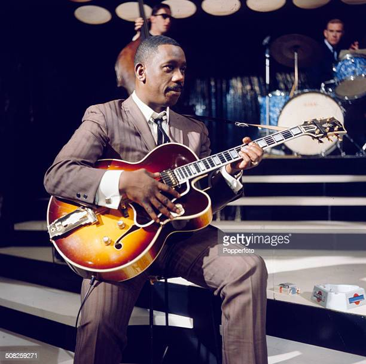

<!--
_class: lead
-->

# オススメジャズギター3選

---

## ジャズと聞くと…

イメージするのは→のようなバンド編成でしょうか？

管楽器、ピアノ、ベース、ドラム …

---

# 今回とりあげるのは`ジャズギター`

- フルアコの温かみのある音色
- ロックや弾き語りのコードとは違うおしゃれなハーモニー
- ジャズならではのリズム感
- いぶし銀な演奏

写真はフルアコギターの一例（Gibson ES-350）

---

# そもそもジャズって何やってんの？

- ジャズの演奏の簡単な流れ

---

<!--
_class: lead
-->

# ギタリストと代表作の紹介

---

## Wes Montgomery (ウェス･モンゴメリー)

- 親指ピッキングの独特な音色
- シングルトーン→オクターブ奏法→コードソロというプレイスタイル

---

### Wes Montgomery (ウェス･モンゴメリー)オススメアルバム

- Smokin' At The Half Note [Apple Music](https://music.apple.com/jp/album/smokin-at-the-half-note-expanded-edition/1510031519)
- The Incredible Jazz Guitar of Wes Montgomery [Apple Music](https://music.apple.com/jp/album/incredible-jazz-guitar-wes-montgomery-keepnews-collection/1440941451)
- Full House [Apple Music](https://music.apple.com/jp/album/full-house-remastered/1443134578)

  

---

## Grant Green（グラント・グリーン）

- 後ろノリのリズム（レイドバック）とスタッカートが特徴的
- メロディー、ソロをシングルトーンで引き切る
- 同じフレーズを繰り返す
- ブルース感溢れる演奏

---

### Grant Green（グラント・グリーン）オススメアルバム

- Grant's First Stand [Apple Music](https://music.apple.com/jp/album/grants-first-stand-the-rudy-van-gelder-edition/715929361)
- The Complete Quartets with Sonny Clark [Apple Music](https://music.apple.com/jp/album/the-complete-quartets-with-sonny-clark/724775096)
- Green Street [Apple Music](https://music.apple.com/jp/album/green-street-the-rudy-van-gelder-edition/723515277)

  

---

## Jim Hall（ジム・ホール）

- 時に不協和音に聞こえる独特なコードヴォイシング
- 4つ刻みでベースラインを表現するスタイルも得意
- モチーフを展開させていく歌心溢れるソロ
- あえて外れた音を出す「アウト」も得意

---

### Jim Hall（ジム・ホール）オススメアルバム

- Jazz Guitar [Apple Music](https://music.apple.com/jp/album/jazz-guitar-remastered/684086666)
- Live! [Apple Music](https://music.apple.com/jp/album/jim-hall-live/1443273247)
- Undercurrent [Apple Music](https://music.apple.com/jp/album/undercurrent-original-album-plus-bonus-tracks/703714593)

  

---

<!--
_class: lead
-->

# おしまい
